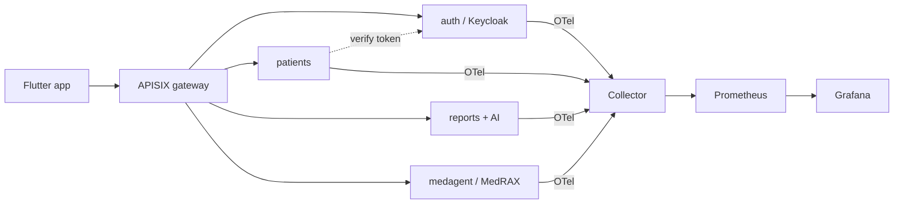

<!-- Banner: generate assets/banner.png from BANNER.md (brandkit / imagegen). -->
<!-- Until generated, the line below 404s gracefully; commit assets/banner.png to fix. -->


# PulmoCare

> Research-only medical-imaging platform: a FastAPI microservice mesh + a
> cross-platform Flutter client, integrating the **MedRAX** chest X-ray
> reasoning agent.

[](.github/workflows/ci.yml)
[-green?style=flat-square)](LICENSE)
[-orange?style=flat-square)](apps/api/services/medagent/LICENSE)
[](mkdocs.yml)
[](deploy/hf-space/)
[](deploy/colab/reproduce_chestagentbench.ipynb)

> [!CAUTION]
> **RESEARCH ONLY — NOT FOR CLINICAL USE.** PulmoCare and the bundled MedRAX
> agent are for research, education, and engineering demonstration **only**.
> This is **not a medical device**, has not been cleared by the FDA/EMA or any
> regulator, and **must not** be used for any clinical, diagnostic, or treatment
> decision for real patients. AI-generated output is unvalidated and may be
> incorrect. See [`LICENSE`](LICENSE) and [`NOTICE`](NOTICE).

---

## What this actually is

PulmoCare is a polyglot monorepo built around an **observable FastAPI
microservice mesh**. Everything below is wired in
[`apps/api/docker-compose.yml`](apps/api/docker-compose.yml) and is the real,
runnable system — not aspiration:

| Concern | Component |
|---|---|
| Identity / SSO | **Keycloak** (+ Postgres) |
| Secrets | **Vault** |
| Service discovery | **Consul**, etcd |
| API gateway | **Apache APISIX** (+ dashboard) |
| Messaging | **RabbitMQ** |
| Cache | **Redis** |
| Data / object store | **MongoDB**, **MinIO** |
| Tracing / metrics / logs | **OpenTelemetry Collector** → **Prometheus**, Tempo, Loki, **Grafana** |
| Quality / CI | SonarQube, Jenkins, Portainer |

Application services (independent `uv` projects under
`apps/api/services/<svc>/app`): **auth**, **patients**, **appointments**,
**medecins**, **medfiles**, **ordonnances**, **radiologues**, **reports** — plus
**`medagent`**, a vendored MedRAX LangGraph agent.

The Flutter client lives under [`apps/mobile`](apps/mobile).

> [!NOTE]
> **Honest status.** The Kubernetes manifests (`apps/api/k8s`) and Ansible
> playbooks (`apps/api/ansible`) are **aspirational** — use `docker compose` for
> development. Several services and the Flutter app are works in progress.

## Architecture



More detail (service mesh + the MedRAX tool graph) in [`docs/`](docs/).

## Quickstart

```bash
# Full stack (Keycloak, Vault, Consul, APISIX, RabbitMQ, OTel, ...)
cd apps/api
docker compose up -d        # real orchestration lives here

# Develop a single service (toolchain: uv + ruff)
cd apps/api/services/auth/app
uv sync --dev
uv run pytest
uv run ruff check . && uv run ruff format --check .
```

## AI feature — structured radiology reports (research only)

The **reports** service exposes MedRAX's report-generation and VQA tools as a
structured endpoint:

```
POST /api/reports/ai/radiology-report
GET  /api/reports/ai/disclaimer
```

It returns structured `findings` / `impression` (and optional `xray_vqa`
answer), plus an optional plain-language narrative generated by Claude
(`claude-haiku-4-5`). **Every response carries the RESEARCH-ONLY banner** and is
intended for clinician review/edit, never for clinical use. MedRAX model weights
load lazily; with no weights the endpoint degrades gracefully instead of
failing. See [`docs/medrax.md`](docs/medrax.md).

## MedRAX attribution

`apps/api/services/medagent` is a vendored copy of **MedRAX**
([bowang-lab/MedRAX](https://github.com/bowang-lab/MedRAX), ICML 2025,
[arXiv:2502.02673](https://arxiv.org/abs/2502.02673)), redistributed under the
**Apache License 2.0** (kept intact at `apps/api/services/medagent/LICENSE`).
First-party PulmoCare code is **MIT** ([`LICENSE`](LICENSE)). See
[`NOTICE`](NOTICE) and [`CITATION.cff`](CITATION.cff).

## Demo & hosting

The headline demo is a **Hugging Face ZeroGPU Gradio Space** wrapping MedRAX's
own `interface.py` (`create_demo`). A ready-to-push scaffold lives at
[`deploy/hf-space/`](deploy/hf-space/) (`app.py` + `requirements.txt` + the Space
`README.md` with `sdk: gradio` / `hardware: zero-gpu` front-matter). It loads the
agent, wraps GPU tool calls in `@spaces.GPU`, and shows the RESEARCH-ONLY banner.

- **ML demo** → HF ZeroGPU Space (Gradio-only; *using* ZeroGPU is free, *hosting*
  needs HF PRO).
- **API mesh** → a free container host. Note (2026): **Fly.io's free tier is
  gone** and **Koyeb dropped free web compute**; **Render** still offers an
  always-free Docker web service (750 hr/month, spins down after 15 min idle) —
  good for one demo service, not the full multi-sidecar mesh.
- **Docs** → Cloudflare Pages (mkdocs build). Workers run JS/WASM, not
  long-running Python, so the FastAPI mesh is **not** a Workers fit.

Full steps, secrets, and cited 2026 sources: [`deploy/README.md`](deploy/README.md).
(Live deploys are gated behind accounts/tokens; the scaffolds are ready.)

## Reproducibility & community

- **MedRAX / ChestAgentBench** reproduction notebook stub:
  [`deploy/colab/reproduce_chestagentbench.ipynb`](deploy/colab/reproduce_chestagentbench.ipynb)
  (points at the upstream benchmark; no weights committed here).
- Suggested **GitHub topics**: `medical-imaging`, `chest-xray`, `langgraph`,
  `medrax`, `fastapi`, `microservices`, `flutter`, `radiology`, `research-only`,
  `observability`.
- Submission targets: the MedRAX ICML reproducibility track and
  **Awesome-Healthcare-Foundation-Models** (as a downstream integration), with
  the RESEARCH-ONLY disclaimer kept prominent.
- Contributing: [`CONTRIBUTING.md`](CONTRIBUTING.md) ·
  [`CODE_OF_CONDUCT.md`](CODE_OF_CONDUCT.md) · [`SECURITY.md`](SECURITY.md).

## Engineering decisions

- **License scoping, not blanket MIT.** MedRAX is vendored under Apache-2.0 with
  citation obligations; relicensing it would be wrong. First-party code is MIT;
  the agent keeps its license + a `NOTICE`/`CITATION.cff`.
- **uv + ruff, no black/pip.** Every service is an isolated `uv` project; CI runs
  a real per-service matrix (`uv sync` → `ruff check`/`format --check` → `ty` →
  `pytest`) with no `|| echo` failure-swallowing.
- **Test the agent's routing, not its weights.** MedRAX tool-routing is tested
  with a scripted model + mocked tools — no GPU/weights in CI. testcontainers
  and schemathesis are scheduled/manual CI jobs.
- **Cloudflare Pages for docs only.** The FastAPI mesh + ML + Keycloak/Vault are
  container/k8s workloads, not a Workers fit; only the mkdocs site deploys to CF
  Pages (gated on secrets). The live ML demo goes to a HF Space.
- **PHI-aware AI review.** A `claude-code-action` workflow flags PHI handling in
  patients/medfiles and any AI output missing the research banner.

## Documentation

mkdocs-material site (Mermaid diagrams, MedRAX tool graph). Build locally:

```bash
pip install -r docs/requirements.txt
mkdocs serve
```

## License

- First-party code: **MIT** — [`LICENSE`](LICENSE).
- `apps/api/services/medagent` (MedRAX): **Apache-2.0** — kept intact.
- Model weights / datasets: their own licenses; not distributed here.

**RESEARCH ONLY — not a medical device.**

## Author

**Ali Ammari** — [@aliammari1](https://github.com/aliammari1)
