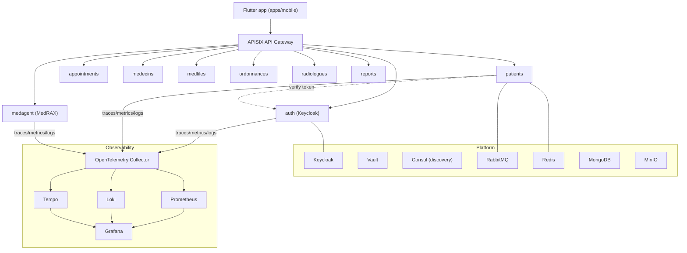

# Architecture

PulmoCare is a polyglot monorepo: a Python FastAPI microservice mesh, a vendored
LangGraph agent, and a Flutter client. Services are independent `uv` projects
(most under `apps/api/services/<svc>/app`).

## Service mesh

## Observable building blocks (from `apps/api/docker-compose.yml`)

| Concern | Component |
|---|---|
| Identity / SSO | Keycloak (+ Postgres) |
| Secrets | Vault |
| Service discovery | Consul, etcd |
| API gateway | Apache APISIX (+ dashboard) |
| Messaging | RabbitMQ |
| Cache | Redis |
| Data | MongoDB, MinIO (object store) |
| Tracing / metrics / logs | OpenTelemetry Collector → Prometheus, Tempo, Loki, Grafana |
| Quality / CI | SonarQube, Jenkins, Portainer |

## Cross-service auth

Downstream services do not trust tokens directly: e.g. `patients` calls
`auth`'s `/api/auth/token/verify` to validate a bearer token and resolve roles
before serving patient data. Endpoints require a healthcare role
(`patient`/`doctor`/`radiologist`/`admin`).

## Honest status

Kubernetes manifests (`apps/api/k8s`) and Ansible playbooks
(`apps/api/ansible`) exist but are **aspirational** — use
`docker compose` for development. The Flutter client and several services are
works in progress.
