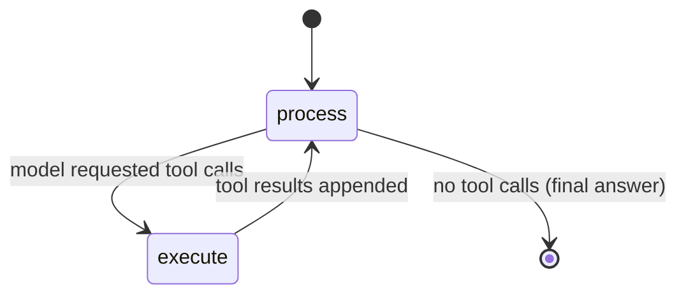

# MedRAX agent

`apps/api/services/medagent` is a **vendored copy of MedRAX**
([bowang-lab/MedRAX](https://github.com/bowang-lab/MedRAX), ICML 2025,
[arXiv:2502.02673](https://arxiv.org/abs/2502.02673)), redistributed under the
**Apache License 2.0** (see `apps/api/services/medagent/LICENSE` and the
top-level `NOTICE`).

MedRAX is **not** a single model — it is a **LangGraph agent** that routes a
language model's tool calls to specialized chest X-ray tools.

## Tool graph

`Agent` (`medrax/agent/agent.py`) compiles this `process → execute → process`
loop. `process_request` invokes the bound model; `has_tool_calls` decides
whether to branch to `execute`; `execute_tools` dispatches each call to the
matching tool and feeds `ToolMessage` results back.

## Tools

| Tool | Purpose |
|---|---|
| `chest_xray_report_generator` | ViT-BERT findings + impression report (CheXpert/MIMIC-CXR) |
| `xray_vqa` | Visual question answering over a chest X-ray |
| `classification` | Pathology classification (TorchXRayVision) |
| `segmentation` / `grounding` | Region segmentation / phrase grounding |
| `dicom` | DICOM ingestion |
| `generation` | Image generation utilities |

## Testing without GPU or weights

CI exercises the **routing logic only**, with a scripted fake model and fake
tools — no torch, no weights, no network. See
`apps/api/services/medagent/tests/test_agent_routing.py`.

## Radiology-report API

The first-party `report_service` exposes MedRAX's report tools as a structured
endpoint — see [the report endpoint](development.md#radiology-report-endpoint).
Every response carries the RESEARCH-ONLY banner.

## Demo

MedRAX ships `interface.py` (Gradio) and a demo GIF under `assets/`. The planned
public demo is a **Hugging Face (ZeroGPU) Gradio Space** — see the README.
